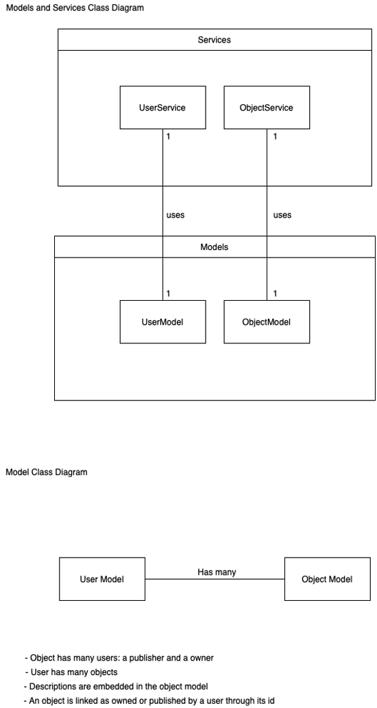

# Lost & Found

# **Overview**

**It happens that people forget or lose their belongings unintentionally.**

**Lost&amp;found** is an application that helps people find their lost objects by displaying all the published objects found by other people. As an example, let&#39;s suppose a person B lost an object B, and a person A found it. Person A must report the object B as being found until person B finds it on the page specified for displaying found objects, he should provide some unique details about the object so that the person A can make sure the item really belongs to person B, once verified, person B will be able to get his item object back.

# **Requirements**

**Functional Requirements**

- **Roles/Actors**

  - There are two roles / types of actors:
    - User:
      - User willing to publish a found object
      - User willing to search for a lost object (found object by another user)
    - Admin:
      - Administration user that has the control over all the users.

- **User Functionalities**

  - A user must be able to browse found objects by location and type.
  - A user must be able to create an account.
  - A registered user must be able to publish or unpublish an object as found.
  - A registered user must be able to claim an already posted object as lost and provide additional information about the object.
  - A registered user must be able to claim an already posted object as returned
  - A registered user must be able to modify its profile information.
  - A registered user must be able to browse users by names.
  - A registered user must be able to view users&#39; profile which includes found/lost object.

- **Admin Functionalities**

  - A default admin account must be automatically created.
  - An admin must be able to create/delete other admin accounts.
  - An admin must be able to ban permanently (remove) user account

**Non-Functional Requirements**

- **Security**

  - Data traffic must be encrypted using SSL and HTTPS.
  - The web service should be ALWAYS available, high availability practices must be respected; no point of failure is accepted.
  - Data should not be accessible publicly.

- **Performance**

  - PageSpeed Insights score should not be less than 60% for mobile, and 70% for desktop.

- **Scalability**

  - The system should be easily scalable, to serve as many users connected without a loss in performance for the optimal cost.

- **Extensibility**

  - The system must be ready to acquire more functionalities with less efforts.

- **Usability**

  - The application design should respect the laws of UX.

## Architecture

- \*\*Physical Architecture -

  

- \*\*Logical Architecture -

  

## Design

### Sequence Diagrams

  

### Model Diagrams

  

## Development

**Starting point**

- Clone this repository
- npm install
- npm start
  dev:
  - nodemon
